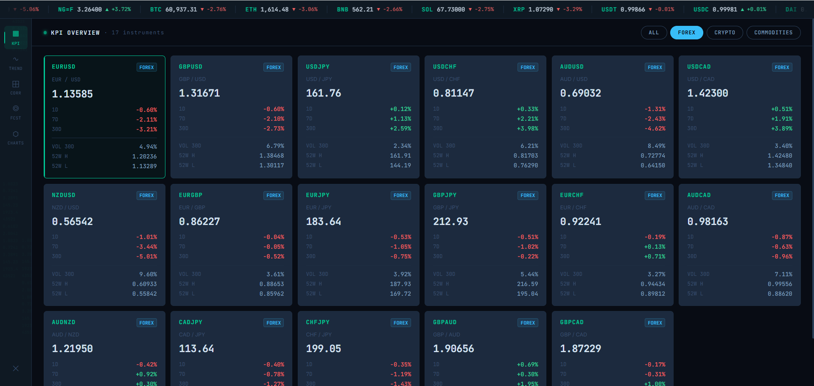
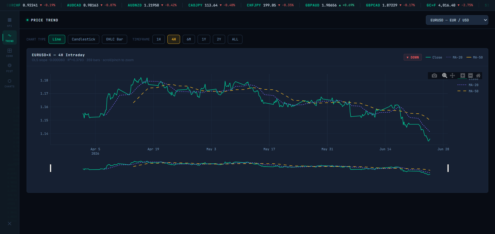
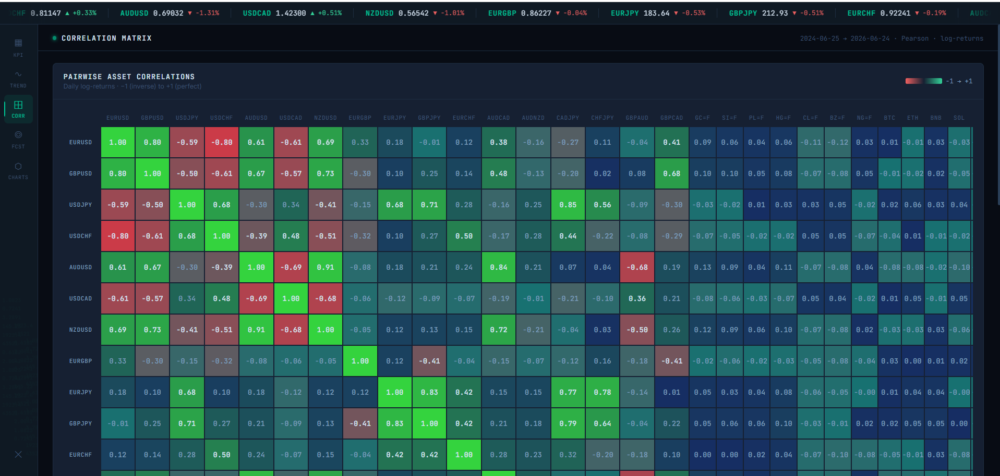
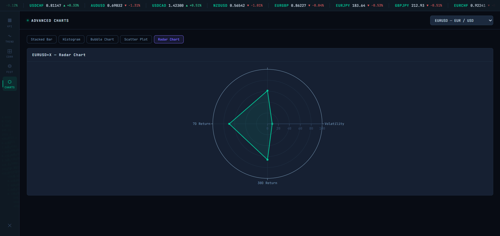
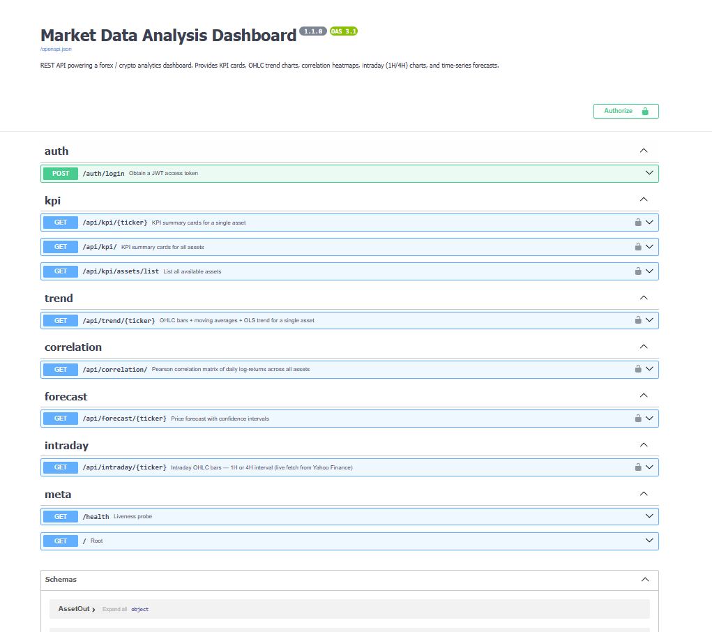

# Data Analysis Dashboard

> **Full-stack financial analytics terminal** — real-time market data, intraday charts, OLS trend regression, multi-asset correlation, and AI-powered forecasting across 32 instruments.


---

## Overview

A production-grade market analytics terminal that ingests 2 years of daily OHLCV data for **32 instruments** across Forex, Crypto, Metals, and Energy markets — then exposes the full analytical stack through a FastAPI backend and a Bloomberg-style frontend built with vanilla JS and Plotly.js.

**Built as a portfolio project** demonstrating backend architecture, statistical analysis pipelines, time-series forecasting, intraday data handling, and professional data visualisation.

---

## Screenshots

### KPI Overview — Category Filter

> Live price cards filtered by market segment (All / Forex / Crypto / Commodities), grouped with 1D/7D/30D returns, volatility, and 52-week range.

### Price Trend — 4H Intraday Chart

> EURUSD 4-hour intraday chart with MA-20 and MA-50 overlays, OLS trend classification, and scroll/pinch zoom. Supports Line, Candlestick, and OHLC Bar types.

### Correlation Heatmap

> Pearson correlation matrix of daily log-returns across all 32 assets — colour-scaled from −1 (inverse) to +1 (perfect). Hover for exact values.

### Advanced Charts — Radar

> Multi-metric radar chart normalising volatility, 1D/7D/30D returns across all assets for quick visual comparison.

### API Documentation

> Auto-generated OpenAPI docs at `/docs` — all endpoints with JWT auth, request/response schemas, and live testing.

---

## Dashboard Features

### KPI Overview
Live price cards filterable by market category (All / Forex / Crypto / Commodities), grouped by segment. Each card shows 1D / 7D / 30D returns, annualised 30-day volatility, and 52-week high/low.

### Trend Analysis
Interactive OHLC chart with MA-20 and MA-50 overlays and OLS linear regression fit. Supports:
- **Chart types:** Line · Candlestick · OHLC Bar
- **Timeframes:** 1H · 4H · 6M · 1Y · 2Y · ALL
- **Intraday (1H/4H):** Live fetch from Yahoo Finance, resampled on the fly
- **Zoom:** Scroll/pinch zoom with Plotly modebar

### Correlation Heatmap
Pearson correlation matrix of daily log-returns across all 32 assets — colour-scaled from −1 (inverse) to +1 (perfect).

### Price Forecast
Prophet model with linear regression fallback. Outputs in-sample fitted values, out-of-sample predictions (5–180 day horizon), 80% prediction intervals, and holdout MAE / RMSE metrics.

### Advanced Charts
Five additional Plotly.js visualisations:
- **Stacked Bar** — monthly OHLC grouped bar
- **Histogram** — daily return distribution
- **Bubble Chart** — volatility vs. 30D return across all assets
- **Scatter Plot** — price vs. MA-20 cross-section
- **Radar Chart** — multi-metric normalised comparison

---

## Instrument Coverage — 32 Instruments

| Segment | Count | Instruments |
|---------|-------|-------------|
| **Forex Major** | 7 | EUR/USD · GBP/USD · USD/JPY · USD/CHF · AUD/USD · USD/CAD · NZD/USD |
| **Forex Minor** | 10 | EUR/GBP · EUR/JPY · GBP/JPY · EUR/CHF · AUD/CAD · AUD/NZD · CAD/JPY · CHF/JPY · GBP/AUD · GBP/CAD |
| **Metals** | 4 | Gold · Silver · Platinum · Copper |
| **Energy** | 3 | WTI Crude Oil · Brent Crude · Natural Gas |
| **Crypto Major** | 5 | Bitcoin · Ethereum · BNB · Solana · XRP |
| **Stablecoins** | 3 | USDT · USDC · DAI |

---

## Tech Stack

| Layer | Technology | Purpose |
|-------|-----------|---------|
| **API** | FastAPI + Pydantic v2 | REST endpoints, request validation, OpenAPI docs |
| **Database** | PostgreSQL + SQLAlchemy 2.0 | OHLCV storage, ORM models, indexed queries |
| **Auth** | JWT (python-jose + passlib) | Stateless Bearer token authentication |
| **Analysis** | pandas · NumPy · statsmodels · scikit-learn | KPI computation, OLS regression, correlation |
| **Forecasting** | Prophet · linear regression | Time-series prediction with confidence intervals |
| **Data Ingestion** | yfinance | Daily + intraday OHLCV from Yahoo Finance |
| **Frontend** | Vanilla JS + Plotly.js | Single-file SPA, zero build toolchain |

---

## Project Structure

```
data-analysis-dashboard/
├── backend/
│   ├── app/
│   │   ├── main.py              # FastAPI app, CORS, router registration
│   │   ├── config.py            # pydantic-settings, .env support
│   │   ├── database.py          # SQLAlchemy engine, session factory, Base
│   │   ├── models.py            # ORM: Asset, MarketData
│   │   ├── schemas.py           # Pydantic v2 request/response contracts
│   │   ├── auth.py              # JWT creation and Bearer token guard
│   │   ├── routers/
│   │   │   ├── auth.py          # POST /auth/login
│   │   │   ├── kpi.py           # GET  /api/kpi/*
│   │   │   ├── trend.py         # GET  /api/trend/{ticker}
│   │   │   ├── intraday.py      # GET  /api/intraday/{ticker}?interval=1h|4h
│   │   │   ├── correlation.py   # GET  /api/correlation/
│   │   │   └── forecast.py      # GET  /api/forecast/{ticker}
│   │   └── analysis/
│   │       ├── statistics.py    # KPI metrics, OLS trend, Pearson correlation
│   │       └── forecaster.py    # Prophet + linear regression fallback
│   ├── seed_data.py             # CLI: yfinance → PostgreSQL (32 instruments)
│   └── requirements.txt
├── frontend/
│   └── index.html               # Single-file SPA — all JS inline, Plotly CDN
└── docs/
    └── screenshots/             # Dashboard screenshots
```

---

## Quick Start

### Prerequisites
- Python 3.11+
- PostgreSQL 14+

### 1. Clone

```bash
git clone https://github.com/Mehdiest/Data-Analysis-Dashboard.git
cd Data-Analysis-Dashboard
```

### 2. Install dependencies

```bash
cd backend
pip install -r requirements.txt
```

### 3. Configure environment

```bash
cp .env.example .env
# Set DATABASE_URL and SECRET_KEY
```

### 4. Create the database

```bash
psql -U postgres -c "CREATE DATABASE market_dashboard;"
```

### 5. Seed market data

```bash
python seed_data.py --reset
# Fetches 2 years of daily OHLCV for all 32 instruments
```

### 6. Start the API

```bash
# Terminal 1
python -m uvicorn app.main:app --reload --port 8000
# Docs: http://localhost:8000/docs
```

### 7. Open the dashboard

```bash
# Terminal 2
python -m http.server 3000 --directory ../frontend
# Open: http://localhost:3000
```

---

## API Reference

| Method | Endpoint | Description |
|--------|----------|-------------|
| `POST` | `/auth/login` | Obtain JWT Bearer token |
| `GET` | `/api/kpi/` | KPI cards — all instruments |
| `GET` | `/api/kpi/{ticker}` | KPI card — single instrument |
| `GET` | `/api/kpi/assets/list` | Full instrument catalogue |
| `GET` | `/api/trend/{ticker}` | Daily OHLC + MA-20/50 + OLS trend |
| `GET` | `/api/intraday/{ticker}` | Intraday bars — live fetch (1H/4H) |
| `GET` | `/api/correlation/` | Pearson correlation matrix |
| `GET` | `/api/forecast/{ticker}` | Prophet / linear regression forecast |
| `GET` | `/health` | Liveness probe |

**Query parameters:**
- `/api/trend/{ticker}` — `start_date`, `end_date` (ISO date)
- `/api/intraday/{ticker}` — `interval=1h` or `interval=4h`
- `/api/forecast/{ticker}` — `horizon_days` (int, 5–180, default 30)

---

## Demo Credentials

| | |
|--|--|
| Username | `admin` |
| Password | `dashboard123` |

---

## License

MIT
